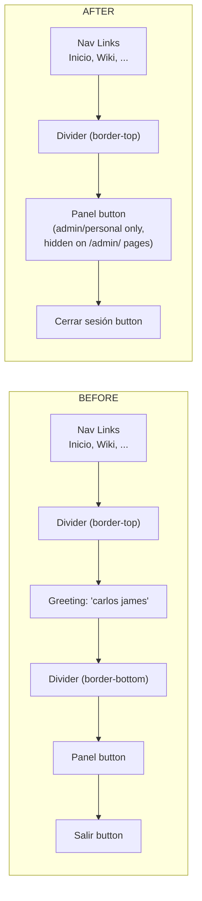

# Plan: Navbar & Drawer Mobile Fixes

## Overview

Four changes to the navbar/drawer system across HTML, CSS, and JS files.

---

## Requirement 1: Hide "Panel" and "Salir" from main navbar on mobile

**Problem:** On screens < 1024px, `#navbar-usuario` (containing user name, "Panel" link, "Salir" button) is still visible in the `.nav-actions` area alongside the burger button, causing clutter and potential overflow.

**Solution:** Add a CSS media query to hide `.navbar-usuario` at the same breakpoint where the burger button appears.

### File: [`assets/css/layout.css`](assets/css/layout.css)
**Insert after line 165** (after the `@media (max-width:480px)` block):

```css
/* Hide navbar user section on mobile — only show inside drawer */
@media (max-width: 1023px) {
  .navbar-usuario {
    display: none !important;
  }
}
```

**Why `!important`:** Because `actualizarNavbar()` in auth.js sets `divUsuario.style.display = 'flex'` inline (line 60), which would override a normal CSS rule. The `!important` ensures the media query wins on small screens.

---

## Requirement 2: Hide "Panel" link when on admin pages

**Problem:** When the user is already on an `/admin/` page, the "Panel" link in both the navbar and drawer is redundant.

**Solution:** In `actualizarNavbar()`, after the existing role-based visibility checks, add a check for `window.location.pathname.startsWith('/admin/')` and force-hide both links.

### File: [`assets/js/auth.js`](assets/js/auth.js)

**Change 1 — After line 64** (after `linkAdmin.style.display = ...`):
```js
// Hide "Panel" link in navbar if already on an admin page
if (linkAdmin && window.location.pathname.startsWith('/admin/')) {
  linkAdmin.style.display = 'none';
}
```

**Change 2 — After line 78** (after `drawerLinkAdmin.style.display = ...`):
```js
// Hide "Panel" link in drawer if already on an admin page
if (drawerLinkAdmin && window.location.pathname.startsWith('/admin/')) {
  drawerLinkAdmin.style.display = 'none';
}
```

---

## Requirement 3: Fix right-edge overflow on mobile

**Problem:** Horizontal scrollbar appears on mobile despite `overflow-x: hidden` on `<body>` (already present at [`base.css:123`](assets/css/base.css:123)). The `.nav-brand-text` with long text or the `.nav-actions` gap can push content beyond viewport.

**Solution:** Constrain the brand text width and reduce gaps on very small screens.

### File: [`assets/css/layout.css`](assets/css/layout.css)

**Modify the existing `@media (max-width:480px)` block (lines 150-165):**

```css
@media (max-width:480px) {
  .nav-row {
    gap: var(--s2); /* reduced from var(--s3) */
  }

  .btn#btn-login-nav {
    font-size: 0;
    line-height: 0;
  }

  .btn#btn-login-nav::before {
    content: "⇥";
    font-size: 16px;
    line-height: 1;
  }

  /* Prevent brand text from causing overflow */
  .nav-brand-text {
    max-width: calc(100vw - 160px);
  }
}
```

Also add a more aggressive overflow fix at the very narrowest screens:

```css
@media (max-width: 380px) {
  .nav-brand-text {
    max-width: calc(100vw - 140px);
  }
  .nav-actions {
    gap: var(--s1);
  }
}
```

---

## Requirement 4: Redesign drawer user section

### 4a. Remove greeting/name line

**File:** [`components/navbar.html`](components/navbar.html)
**Line 124:** Remove the entire `<div class="drawer-user-greeting" id="drawer-user-greeting"></div>` line.

### 4b. Remove extra divider lines

Currently there are two dividers:
1. `.drawer-user-actions` has `border-top` (CSS line 464) — **keep this one** (separates user section from nav links)
2. `.drawer-user-greeting` has `border-bottom` (CSS line 473) — **goes away** when we remove the greeting element

**File:** [`assets/css/layout.css`](assets/css/layout.css)
**Lines 468-478:** Remove the entire `.drawer-user-greeting` CSS block.

### 4c. Move "Panel" and "Cerrar sesión" up, separated by single divider

**File:** [`assets/css/layout.css`](assets/css/layout.css)
**Line 465:** Remove `margin-top: auto` from `.drawer-user-actions`. This makes the user section sit directly below the nav links, with only the `border-top` divider between them.

Change from:
```css
.drawer-user-actions {
  display: flex;
  flex-direction: column;
  gap: var(--s1);
  padding: var(--s4);
  border-top: 1px solid var(--color-borde-suave);
  margin-top: auto;
}
```

To:
```css
.drawer-user-actions {
  display: flex;
  flex-direction: column;
  gap: var(--s1);
  padding: var(--s4);
  border-top: 1px solid var(--color-borde-suave);
}
```

### 4d. Change "Salir" to "Cerrar sesión"

**File:** [`components/navbar.html`](components/navbar.html)
**Line 146:** Change `<span>Salir</span>` to `<span>Cerrar sesión</span>`.

### 4e. "Panel" only for admin/personal

Already implemented in [`auth.js`](assets/js/auth.js) lines 64 and 76-78. No change needed. The admin-page check from Requirement 2 will also apply.

### 4f. Remove greeting text assignment in JS

**File:** [`assets/js/auth.js`](assets/js/auth.js)
**Lines 73-75:** Remove the `drawerGreeting` textContent assignment since the element no longer exists:

```js
// REMOVE these lines:
if (drawerGreeting) {
  drawerGreeting.textContent = usuario.perfil?.nombre_completo || usuario.email;
}
```

---

## Summary of All File Changes

| File | Change Type | Details |
|------|------------|---------|
| [`components/navbar.html`](components/navbar.html:124) | Remove line | Remove `<div class="drawer-user-greeting" ...>` (line 124) |
| [`components/navbar.html`](components/navbar.html:146) | Edit text | Change `Salir` → `Cerrar sesión` (line 146) |
| [`assets/js/auth.js`](assets/js/auth.js:64) | Insert after line 64 | Add admin-path check for `#link-admin` |
| [`assets/js/auth.js`](assets/js/auth.js:78) | Insert after line 78 | Add admin-path check for `#drawer-link-admin` |
| [`assets/js/auth.js`](assets/js/auth.js:73) | Remove lines 73-75 | Remove `drawerGreeting.textContent` assignment |
| [`assets/css/layout.css`](assets/css/layout.css:465) | Edit property | Remove `margin-top: auto` from `.drawer-user-actions` |
| [`assets/css/layout.css`](assets/css/layout.css:468) | Remove block | Remove `.drawer-user-greeting` CSS block (lines 468-478) |
| [`assets/css/layout.css`](assets/css/layout.css:150) | Insert after line 165 | Add `@media (max-width:1023px)` hiding `.navbar-usuario` |
| [`assets/css/layout.css`](assets/css/layout.css:150) | Modify block | Reduce gap, add `max-width` constraint in `@media (max-width:480px)` |
| [`assets/css/layout.css`](assets/css/layout.css:143) | Insert after line 147 | Add `@media (max-width:380px)` for tighter overflow control |

---

## Mermaid: Before/After Drawer Structure


